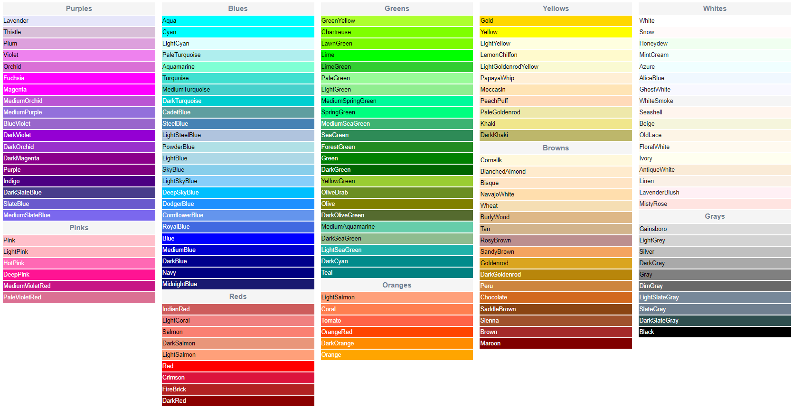

# All imports
```
use <../library/elec-cartes/elec-cartes.scad>
use <../library/elec-comps/elec-comps.scad>
use <../library/meca-comps/meca-comps.scad>
```


----------
# Documentation OpenScad
[Cheatsheet](https://openscad.org/cheatsheet/index.html)<br>
[Documentation](https://en.wikibooks.org/wiki/OpenSCAD_User_Manual)<br>
Colors:



----------
# Documentation
## Elec - Cartes (use <../library/elec-cartes/elec-cartes.scad>)
```scad
arduino_uno();
sequenceur();
```

## Elec - composants (use <../library/elec-comps/elec-comps.scad>)
```scad
diode();
interrupteur();
moteur_1();
pile_9V();
```

## Meca - composants (use <../library/meca-comps/meca-comps.scad>)
```scad
aileron(m, n, E, p, epaisseur);
equerre(h1, h2, l, e);
bague_creuse(diametre_externe, diametre_interieur, epaisseur);
bague_de_poussee(
    diametre_exterieur,
    diametre_intermediaire,
    diametre_interieur,
    epaisseur_exterieure,
    epaisseur_interieure
);
bague_pleine(diametre, epaisseur);
guide_rampe();
ogive(hauteur, diametre, epaisseur);
ogive_pleine(hauteur, diametre);
ressort(diametre, section, hauteur, nb_spire);
tube(hauteur, diametre, epaisseur);
```


----------
# Notes
Bug du crash de l'extension réglé

**A $fn over 128 is not recommended** or only for specific circumstances, and below 50 would be advisable for performance.

You can also use two different values for prview and render
```scad
$fn= $preview ? 32 : 64;
```